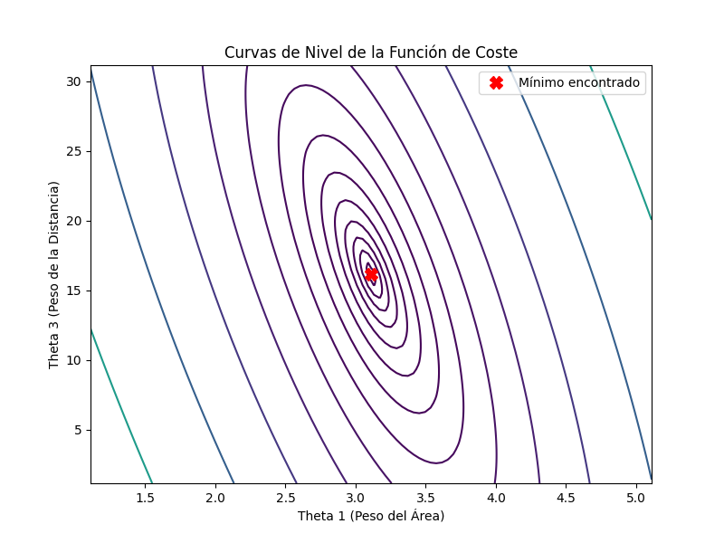

# Optimización de Modelos Predictivos mediante Cálculo Multivariado: El Caso de la Regresión Lineal

**Autores:** [Nombres de los integrantes]
**Curso:** Cálculo en Varias Variables | **Fecha:** [Fecha]

---

## 1. El Puente entre el Cálculo y el Machine Learning

### 1.1 El Problema: ¿Cómo "Aprende" una Máquina?
El "aprendizaje" en Machine Learning no es más que un proceso de **optimización**. El objetivo es crear un modelo matemático que pueda hacer predicciones sobre datos que nunca ha visto. Para lograrlo, le mostramos ejemplos (nuestros datos) y ajustamos sus parámetros internos hasta que sus predicciones sobre esos ejemplos sean lo más precisas posible. La pregunta fundamental es: ¿cómo realizamos ese "ajuste" de manera eficiente?

### 1.2 La Solución: El Cálculo Multivariado como Motor
Aquí es donde entra el cálculo. El "error" de nuestro modelo se puede describir con una **función de coste**, $J(\theta)$, que depende de los parámetros del modelo, $\theta$. Esta función representa un "paisaje de error", y nuestro objetivo es encontrar el punto más bajo de este paisaje.

La herramienta fundamental del cálculo multivariado para esta tarea es el **gradiente**, $\nabla J(\theta)$.
- **¿Qué es el gradiente?** Es un vector que contiene todas las derivadas parciales de la función de coste. Geométricamente, en cualquier punto del paisaje de error, el gradiente apunta en la dirección de la **máxima pendiente ascendente**.
- **¿Cómo lo usamos?** Si queremos encontrar el punto más bajo (minimizar el error), debemos movernos en la dirección contraria al gradiente, es decir, en la dirección de la **máxima pendiente descendente**. Este es el principio del algoritmo de **Descenso de Gradiente**.

---

## 2. Ejemplo: Predicción de Precios de Vivienda

### 2.1 El Contexto del Problema
Queremos predecir el **precio de una casa ($y$)** en miles de dólares, basándonos en tres de sus características (o *features*):
- **$x_1$**: Área construida (en m²)
- **$x_2$**: Número de habitaciones
- **$x_3$**: Distancia al centro de la ciudad (en km)

### 2.2 Los Datos de Entrenamiento
| Casa (i) | Precio (y) | Área ($x_1$) | Habitaciones ($x_2$) | Distancia ($x_3$) |
| :--- | :--- | :--- | :--- | :--- |
| 1 | 300 | 150 | 3 | 5 |
| 2 | 250 | 120 | 2 | 10 |
| 3 | 450 | 200 | 4 | 2 |
| 4 | 350 | 180 | 3 | 3 |
| 5 | 200 | 100 | 2 | 12 |

*Visualización del problema. Cada punto rojo es una casa en un espacio 3D definido por dos características (Área y Distancia) y el Precio. El objetivo del modelo es encontrar el plano azul (el modelo de regresión) que mejor se ajuste a través de esta "nube" de datos.*

### 2.3 Formulación Matemática del Modelo

#### a) La Hipótesis: Un Modelo Lineal
Asumimos que la relación entre las características y el precio es lineal. Nuestra función de hipótesis, $h_\theta(x)$, que predice el precio, es:
$$ h_\theta(x) = \theta_0 + \theta_1 x_1 + \theta_2 x_2 + \theta_3 x_3 $$
- Los **parámetros $\theta_j$** son los "pesos" que el modelo debe aprender. Representan la importancia de cada característica. Por ejemplo, $\theta_1$ nos dirá cuánto aumenta el precio por cada m² adicional. $\theta_0$ es el "precio base" o intercepto.

#### b) La Función de Coste: Midiendo el Error
Para saber qué tan bueno es nuestro modelo, medimos la diferencia entre el precio predicho $h_\theta(x^{(i)})$ y el precio real $y^{(i)}$ para cada casa $i$. Usamos el **Error Cuadrático Medio (MSE)**, que se define en nuestra función de coste $J(\theta)$:
$$ J(\theta) = \frac{1}{2m} \sum_{i=1}^{m} (h_\theta(x^{(i)}) - y^{(i)})^2 $$
- **$(h_\theta(x^{(i)}) - y^{(i)})^2$**: Elevamos al cuadrado la diferencia para que los errores sean siempre positivos y para penalizar más los errores grandes.
- **$\sum_{i=1}^{m}$**: Sumamos los errores de todas las casas de nuestros datos.
- **$\frac{1}{m}$**: Dividimos por el número de casas ($m=5$) para obtener el error promedio.
- **$\frac{1}{2}$**: Se incluye por pura conveniencia matemática. Al derivar, el exponente '2' bajará y se cancelará con este '2', simplificando la ecuación del gradiente.

#### c) El Gradiente: La Derivada de la Función de Coste
Para minimizar $J(\theta)$, necesitamos su gradiente. Calculemos la derivada parcial con respecto a un parámetro, por ejemplo $\theta_1$, usando la regla de la cadena:
$$ \frac{\partial J}{\partial \theta_1} = \frac{\partial}{\partial \theta_1} \left[ \frac{1}{2m} \sum_{i=1}^{m} (\theta_0 + \theta_1 x_1^{(i)} + \dots - y^{(i)})^2 \right] $$
$$ = \frac{1}{2m} \sum_{i=1}^{m} 2 \cdot (\theta_0 + \theta_1 x_1^{(i)} + \dots - y^{(i)}) \cdot \frac{\partial}{\partial \theta_1}(\theta_0 + \theta_1 x_1^{(i)} + \dots - y^{(i)}) $$
$$ = \frac{1}{m} \sum_{i=1}^{m} (h_\theta(x^{(i)}) - y^{(i)}) \cdot x_1^{(i)} $$
Generalizando para cualquier $\theta_j$:
$$ \frac{\partial J}{\partial \theta_j} = \frac{1}{m} \sum_{i=1}^{m} (h_\theta(x^{(i)}) - y^{(i)}) x_j^{(i)} $$
Esta ecuación nos dice cómo cambia el error total cuando cambiamos ligeramente un solo parámetro $\theta_j$.

#### d) El Algoritmo: Descenso de Gradiente
Este es el proceso iterativo que usa el gradiente para "aprender":
1.  Empezar con una suposición inicial para los $\theta$ (normalmente, todos cero).
2.  Calcular el gradiente $\nabla J(\theta)$ en ese punto.
3.  Actualizar los parámetros dando un pequeño paso en la dirección opuesta al gradiente:
    $$ \theta_j := \theta_j - \alpha \frac{\partial J}{\partial \theta_j} $$
    - **$\alpha$ (tasa de aprendizaje)**: Es un número pequeño que controla el tamaño del paso que damos. Es crucial: si es muy pequeño, el aprendizaje es lento; si es muy grande, podemos pasarnos del mínimo y diverger.
4.  Repetir los pasos 2 y 3 miles de veces, o hasta que los parámetros dejen de cambiar significativamente.

*Visualización del proceso de optimización. Este es un "mapa topográfico" de la función de error. El centro (marcado con 'X') es el punto de error mínimo. El Descenso de Gradiente es el algoritmo que "desciende" por esta superficie, siguiendo la dirección opuesta al gradiente, para encontrar ese punto óptimo.*

**¿Por qué el mapa tiene esa forma elíptica?**
La forma de las curvas de nivel se debe directamente a la naturaleza de nuestra función de coste, $J(\theta)$.
1.  **Función Cuadrática:** La función de coste es una función cuadrática de los parámetros $\theta$. Geométricamente, una función cuadrática de dos variables forma una superficie 3D llamada **paraboloide** (similar a un tazón).
2.  **Curvas de Nivel como "Rebanadas":** Las líneas que vemos son las curvas de nivel de ese paraboloide, es como si estuviéramos viendo "rebanadas" horizontales del tazón desde arriba.
3.  **Elipses por la Escala de los Datos:** Las curvas son elipses alargadas en lugar de círculos perfectos debido a que las variables (features) tienen escalas muy diferentes. En nuestro caso, el 'Área' ($x_1$) tiene valores mucho más grandes que la 'Distancia' ($x_3$). Esto hace que la función de coste sea más sensible a pequeños cambios en un parámetro que en otro, "estirando" el tazón y, por lo tanto, sus curvas de nivel.

*Visualización 3D de la función de coste. Se observa la forma de "tazón" o paraboloide, que es característica de las funciones cuadráticas. El punto más bajo de este tazón es el mínimo global que el algoritmo de Descenso de Gradiente busca encontrar.*

---

## 3. Una Iteración Numérica, Paso a Paso

Veamos qué ocurre en la **primera iteración** del algoritmo.

**Configuración Inicial (Iteración 0):**
- Tasa de aprendizaje $\alpha = 0.00001$
- Parámetros iniciales: $\theta_0 = 0, \theta_1 = 0, \theta_2 = 0, \theta_3 = 0$

**Paso 3.1: Calcular Predicciones y Errores**
Como todos los $\theta$ son 0, la predicción $h_\theta(x)$ para cada casa es 0. El error $(h_\theta(x) - y)$ para cada casa es simplemente $-y$.
- Errores: [-300, -250, -450, -350, -200]

**Paso 3.2: Calcular el Gradiente (El Cálculo)**
Usamos la fórmula del gradiente que derivamos. Para cada $\theta_j$, multiplicamos cada error por la característica $x_j$ correspondiente, sumamos todo y promediamos.

- **$\frac{\partial J}{\partial \theta_0}$ (asumiendo $x_0=1$):** $\frac{1}{5}[(-300)\cdot1 + (-250)\cdot1 + \dots] = -310$
- **$\frac{\partial J}{\partial \theta_1}$ (Área):** $\frac{1}{5}[(-300)\cdot150 + (-250)\cdot120 + \dots] = -49600$
- **$\frac{\partial J}{\partial \theta_2}$ (Habitaciones):** $\frac{1}{5}[(-300)\cdot3 + (-250)\cdot2 + \dots] = -930$
- **$\frac{\partial J}{\partial \theta_3}$ (Distancia):** $\frac{1}{5}[(-300)\cdot5 + (-250)\cdot10 + \dots] = -1670$

El vector gradiente $\nabla J(\theta)$ es `[-310, -49600, -930, -1670]`. Nos indica que, para reducir el error, debemos *aumentar* todos los valores de $\theta$.

**Paso 3.3: Actualizar los Parámetros (El Aprendizaje)**
Ahora, ajustamos los $\theta$ usando la regla de actualización: $\theta_j := \theta_j - \alpha \cdot (\text{derivada})$.

- $\theta_0 := 0 - (0.00001) \times (-310) = 0.0031$
- $\theta_1 := 0 - (0.00001) \times (-49600) = 0.496$
- $\theta_2 := 0 - (0.00001) \times (-930) = 0.0093$
- $\theta_3 := 0 - (0.00001) \times (-1670) = 0.0167$

**Reflexión:** Después de un solo paso, el modelo ha empezado a aprender. Ya sabe que el Área ($x_1$) tiene un impacto positivo mucho mayor que las otras características, porque su $\theta_1$ es el que más ha aumentado.

Este proceso se repite, y en cada nueva iteración, las predicciones serán mejores, los errores menores, y el gradiente nos guiará a un ajuste aún más fino, hasta converger.

*Prueba del aprendizaje. Esta curva muestra cómo el error del modelo (eje Y) disminuye con cada paso del algoritmo (eje X). La forma descendente y aplanada es la prueba visual de que el Descenso de Gradiente está funcionando y ha convergido a una solución.*

*Evaluación del rendimiento del modelo. Compara los precios reales (eje X) con los precios predichos (eje Y). La línea roja diagonal representa una predicción perfecta. La proximidad de los puntos a esta línea indica qué tan preciso es el modelo final.*

---

## 4. Conclusiones Profundizadas

Este proyecto ha ilustrado cómo el \textbf{Cálculo Multivariado} no es meramente una rama abstracta de las matemáticas, sino una herramienta indispensable que potencia el \textbf{Machine Learning} moderno. A través del ejemplo de la Regresión Lineal y el Descenso de Gradiente, hemos desglosado el proceso de "aprendizaje" de una máquina, revelando la profunda interconexión entre ambas disciplinas.

1.  \textbf{El Cálculo Multivariado como Cimiento de la Optimización en ML:} Hemos demostrado que la capacidad de un modelo de Machine Learning para adaptarse y mejorar radica directamente en la aplicación de principios del cálculo. La minimización de la función de coste, que representa el error del modelo, es un problema de optimización multivariada. Sin herramientas como el gradiente, el ajuste sistemático de los parámetros del modelo sería inviable.

2.  \textbf{El Descenso de Gradiente: Un Algoritmo Impulsado por el Gradiente:} El algoritmo de Descenso de Gradiente se erige como un testimonio de la eficacia del cálculo. Al seguir la dirección opuesta al gradiente de la función de coste, el algoritmo converge iterativamente hacia un conjunto de parámetros óptimos. Este proceso, aunque conceptualmente simple, es el motor detrás de la capacidad de los modelos para extraer patrones complejos de los datos.

3.  \textbf{La Regresión Lineal: Un Caso de Estudio Fundamental y Versátil:} La Regresión Lineal, optimizada mediante Descenso de Gradiente, ejemplifica la universalidad de estas técnicas. Su aplicación en la predicción de precios de vivienda no es un caso aislado; este mismo fundamento matemático subyace a modelos más complejos en campos tan diversos como la inteligencia artificial, la economía, la ingeniería y las ciencias de la salud, validando el poder unificador del cálculo en la resolución de problemas reales.

4.  \textbf{Interdisciplinariedad y Futuro:} Este estudio subraya la naturaleza intrínsecamente interdisciplinaria de la ciencia de datos y el Machine Learning. La sinergia entre las matemáticas puras (cálculo), la estadística y la computación es lo que permite el desarrollo de sistemas inteligentes capaces de transformar industrias enteras. Comprender estos fundamentos es crucial para innovar y abordar los desafíos emergentes en la era de los datos.

---

## 5. Bibliografía

- Gambella, C., Ghaddar, B., & Naoum-Sawaya, J. (2021). Optimization problems for machine learning: A survey. *European Journal of Operational Research, 290*(3), 807-828.
